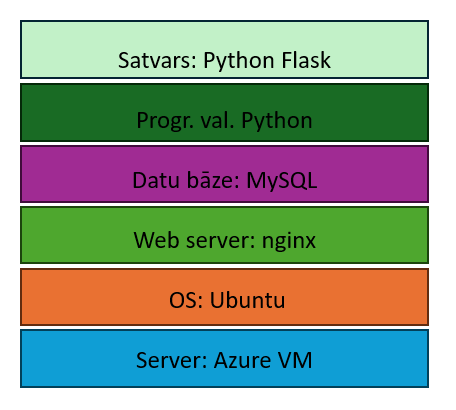

# Apraksts
Rēķinu apstrāde ar OCR un datu analīze
• Project Description: This project aims to develop a solution that enables small and
medium-sized enterprises (SMEs) to accurately report their carbon emissions as part of
their sustainability efforts. The solution will allow companies to upload their invoices as
PDFs, from which data will be extracted about the items purchased and their quantities.
This data will then be used to calculate the total carbon emissions based on predefined
emission factors for each item. The results will be summarized in a comprehensive
report.
• General Scope: The product to be developed is a web-based application designed to
automate the process of carbon emission reporting for SMEs. Users will upload their
invoices in PDF format, and the application will use optical character recognition (OCR)
technology to extract relevant data, such as the items purchased and their quantities.
This data will be stored in a secure database. The application will then apply predefined
emission factors to each item to calculate the total carbon emissions. For example, if an
invoice shows the purchase of 1 liter of gas, the application will use the known emission
factor for gas to calculate the corresponding CO2 emissions. The final output will be a
detailed report summarizing the company’s carbon emissions over a specified period.
The application will feature a user-friendly interface for uploading invoices and viewing
reports, as well as a backend system for data extraction, processing, and report
generation.
• Target Customers and Users: The primary users of this solution are SMEs that need to
comply with new regulations requiring transparent carbon emission reporting. The
target customers include business owners, sustainability officers, and financial
managers who are responsible for environmental reporting and compliance.

# Līdzīgo risinājumu saraksts

* TensorFlow
Apraksts: Rīku kopums, kas iekļauj mašīnmācīšanos (ML) un teksta atpazīšanas funkcionalitāti.</br>
Saite uz risinājumu: https://github.com/tensorflow/examples/tree/master/lite/examples/optical_character_recognition

* ocr-table
Apraksts: GitHub projekts, kurš Spēj nolasīt tabulas un rakstzīmes no pdf formāta un pārvērst tās tekstā</br>
Licence: MIT Lincense</br>
Saite uz risinājumu: https://github.com/cseas/ocr-table

* Carbonfox
Apraksts: Rīks, kas reāllaikā apstrādā uzņēmumu pavadzīmes ar MI palīdzību, lai uzņēmumi varētu sekot līdzi savām GHG(greenhouse gases) emisijām.</br>
Saite uz risinājumu: https://www.snowfox.ai/carbonfox-realtime-insights-for-co2-emissions

* Manga OCR
Apraksts: GitHub projekts, kurš pārveido tekstu no Japāņu manga komiksiem par nolasāmu tekstu.
2024\. gada septembrī šim projektam ir visvairāk zvaigznītes GitHub projektiem Python programmēšanas valodā,
meklējot "Optical character recognition" </br>
Saite uz risinājumu: https://github.com/kha-white/manga-ocr
Licence: Apache-2.0 license</br>

* android-ocr
Apraksts: Eksperimentāla Anroid lietotne, kura veic teksta nolasīšanu no attēla. 2024\. gada Septembrī GitHub repozitorijs ir "Tikai lasīt" režīmā.</br>
Programmēšanas valodas/tehnoloģija: Java, HTML, CSS </br>
Licence: Apache-2.0 license</br>
Saite uz risinājumu: https://github.com/rmtheis/android-ocr

* deep-text-recognition-benchmark
Apraksts: GitHub projekts, kurš veic ziļo mācīšanos no attēliem, lai nolasītu tekstu.
Programmēšanas valodas: Python, Jupyter Notebook</br>
Licence: Apache-2.0 license</br>
Saite uz risinājumu: https://github.com/clovaai/deep-text-recognition-benchmark

* Adobe Acrobat JPG to PDF converter
Apraksts: Nolasa tekstu no attēliem un ieraksta to teksta failā.</br>
Pieejamie formāti no JPG, PNG, BMP u.c. uz PDF</br>
Saite uz risinājumu: https://www.adobe.com/acrobat/online/jpg-to-pdf.html

* IMAGE TO TEXT CONVERTER - OCR ONLINE
Apraksts: Nolasa tekstu no attēliem un ieraksta to teksta failā.</br>
Pieejamie formāti no PNG, BMP, PDF u.c. uz docx, txt, xlsx</br>
Saite uz risinājumu https://www.onlineocr.net/

* Image to Text Converter
Pieejamie formāti no JPG, PDF, text uz doc, text, PDF, JPG 
Apraksts: Nolasa tekstu no attēliem un ieraksta to teksta failā.</br>
Saite uz risinājumu https://www.imagetotext.info/</br>

* Image to Text
Apraksts: Nolasa tekstu no attēliem un ieraksta to teksta failā.</br>
Pieejamie formāti no PNG JPG, BMP, GIF, JPEG, TIFF uz GNUMERIC</br>
Saite uz risinājumu: https://www.prepostseo.com/image-to-text

* Picture to Text Converter
Apraksts: Nolasa tekstu no attēliem un ieraksta to teksta failā.</br>
Pieejamie formāti no JPG, PNG, JPEG, GIF, JFIF uz text </br>
Saite uz risinājumu: https://picturetotext.info/

# Lietotājstāsti

| Nr. | Lietotājstāsts | MoSCoW prioritāte |
|-----|----------------|-------------------|
| 1. | Lietotājs vēlas augšupielādēt rēķinu, lai sistēma aprēķinātu CO2 nospiedumu. | Must have |
| 2. | Lietotājs vēlas ērti augšupielādēt vairākus rēķinus, lai ietaupītu laiku. | Should have |
| 3. | Lietotājs vēlas, lai sistēma pārbauda, ka fails ir PDF formātā, lai nepieļautu nepareiza formāta augšupielādi | Must have |
| 4. | Lietotājs vēlas, lai viņam ir iespēja rediģēt sava augšupielādētā rēķina apstrādātos datus. | Should have |
| 5. | Lietotājs vēlas, lai programma ar OCR iegūtu nepieciešamo informāciju no augšupielādētā rēķina (nr., datums, pasūtītāja informācija, produkti, apjoms, cenas, un to kopējās summas, jo tas var tikt izmantots CO2 aprēķinam | Must have |
| 6. | Lietotājs vēlas, lai augšupielādētie rēķini tiktu saglabāti datu bāzē, jo tad nav nepieciešams tos atkārtoti augšupielādēt | Could have |
| 7. | Lietotājs vēlas, lai informācija par apstrādātiem rēķiniem datu bāzē tiktu uzglabāta atsevišķi kā CSV fails, lai to varētu vēlāk lejupielādēt vai izmantot apstrādei. | Should have |
| 8. | Lietotājs vēlas pievienot rēķinu manuāli, lai papildinātu esošo informāciju par CO2 izmešu aprēķinam | Should have |
| 9. | Lietotājs vēlas izveidot savu unikālu lietotāja kontu, jo tad citiem nav piekļuves viņa augšupielādēto rēķinu datiem. | Must have |
| 10. | Lietotājs vēlas  piesaistīt kontu  e-pasta adresei, jo tad var nodrošināt sava konta atkopšanu | Would not have |
| 11. | Lietotājs vēlas grafisko saskarni, ar filtru, lai atrastu ierakstus pēc dažādiem kritērijiem. | Should have |
| 12. | Lietotājs vēlas savu rēķinu atskaites saglabāt dažādos formātos/ izkārtojumos, atskaites atbilstu dažādu organizāciju prasībām. | Could have |
| 13. | Lietotājs vēlas, lai datu bāze uzglabātu informāciju par izmešiem no dažādiem produktiem/pakalpojumiem, lai tos varētu ērti pārskatīt un izmantot aprēķinam. | Should have |
| 14. | Lietotāji vēlas pievienot datu bāzē papildus produktus/pakalpojumus vai izmainīt to izmešu vērtības, lai precīzāk atspoguļotu kopējos izmešus konkrētajam uzņēmumam. | Should have |
| 15. | Lietotājs vēlas, lai trūkstoša informācija par ieraksta CO2 izmešiem tiktu automātiski aizpildīta no līdzīgākā ieraksta no datu bāzes, lai nerastos aprēķinu kļūdas. | Would not have |
| 16. | Lietotājs vēlas, lai sistēma dotu detalizētus aprēķina procesa rekvizītus, lai datus varētu auditēt. | Could have |
| 17. | Lietotājs vēlas, lai informācija par izmešiem tiktu uzskatāmi izvadīta kontrolpanelī ar iespēju to filtrēt pēc dažādiem kritērijiem, jo tas ļautu ērti pārskatīt datus. | Should have |
| 18. | Lietotājs vēlas, lai sistēma izveidotu PDF, Excel vai cita formāta atskaiti par ilgtspējību, lai to varētu nepieciešamības gadījumā uzrādīt. | Should have |

# Tehnoloģiju steks
## Backend

## Frontend
HTML, CSS - Tailwind, JavaScript

# Konceptu modelis

```mermaid
graph TD;
    ProduktuPak[Produkts/Pakalpojums] -->|n..n| Rekini[Rēķini];
    ProduktuPak[Produkts/Pakalpojums] -->|1..1| Izmesi[Izmeši]
    Uznemumi[Uzņēmumi] -->|1..n| Rekini[Rēķini];
    Uznemumi[Uzņēmumi] -->|1..n| Lietotaji[Lietotāji];
# Risinājuma novērtējums

Risinājuma novērtējuma ietvaros tika veikti 2 ekperimenti.
1. eksperimenta ietvaros tika veikta izpēte, kā apstrādātā PDF faila DPI(dots per inches) apstrādes PDF faila algoritmā un threshold teksta sadalījumam pa blokiem ietekmē faila apstrādes laiku.
2. eksperimenta ietvaros tika veikta izpēte, kā apstrādātā PDF faila DPI(dots per inches) apstrādes PDF faila algoritmā un izvēlētais modelis no Google Gemini API ietekmē faila apstrādes laiku.

## 1. eksperiments
| NR  | DPI | THRESHOLD | TIME    |
|-----|-----|-----------|---------|
| 1   | 100 | 50        | 3.801   |
| 2   | 100 | 100       | 3.7918  |
| 3   | 100 | 150       | 3.4549  |
| 4   | 200 | 50        | 7.6017  |
| 5   | 200 | 100       | 7.5844  |
| 6   | 200 | 150       | 7.6027  |
| 7   | 300 | 50        | 11.9961 |
| 8   | 300 | 100       | 12.27   |
| 9   | 300 | 150       | 11.938  |
## 2. eksperiments
| NR  | DPI | MODEL             | TIME    |
|-----|-----|-------------------|---------|
| 1   | 100 | gemini-1.5-flash  | 5.3917  |
| 2   | 100 | gemini-1.5-flash-8b | 3.4529  |
| 3   | 100 | gemini-1.5-pro    | 5.574   |
| 4   | 200 | gemini-1.5-flash  | 7.664   |
| 5   | 200 | gemini-1.5-flash-8b | 7.3157  |
| 6   | 200 | gemini-1.5-pro    | 10.4936 |
| 7   | 300 | gemini-1.5-flash  | 12.0484 |
| 8   | 300 | gemini-1.5-flash-8b | 11.67   |
| 9   | 300 | gemini-1.5-pro    | 14.8651 |

